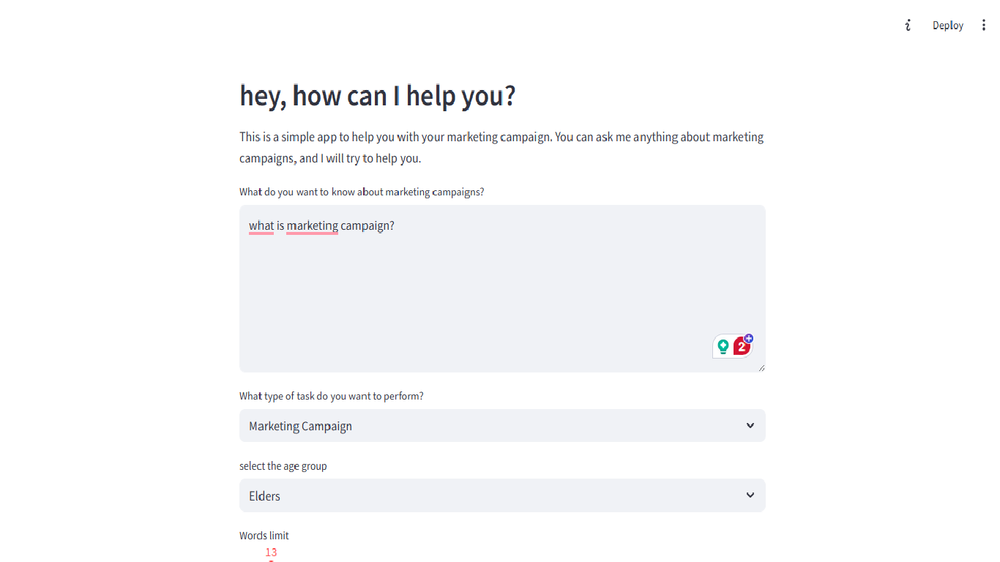
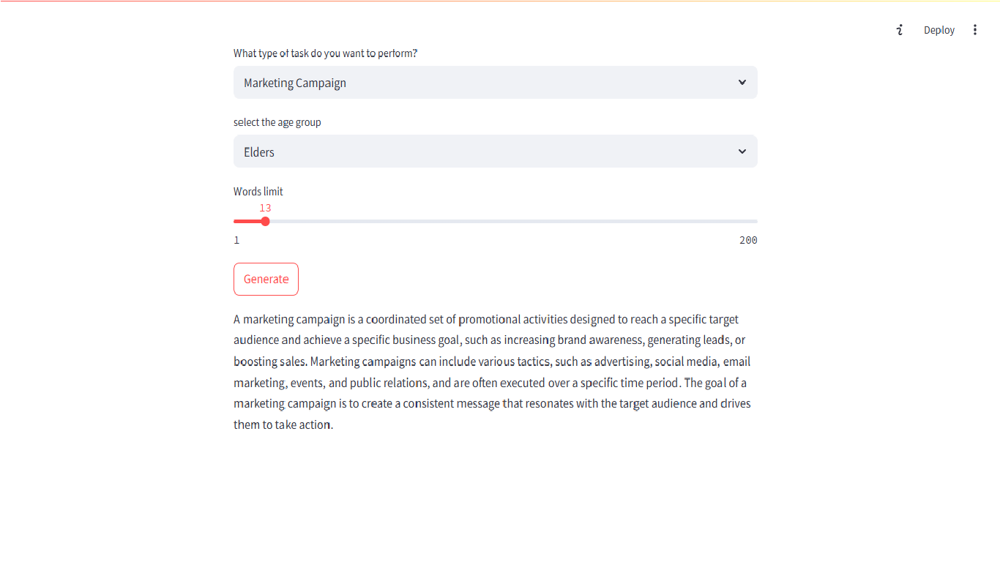

# LangChain Marketing Campaign Generator

This is a Streamlit-based AI app that generates intelligent, tone-adjusted responses for marketing-related queries using **LangChain** and **Mistral-7B LLM** hosted on HuggingFace.  
Responses are tailored based on:
- Age group (Kids, Adults, Elders)
- Task type (e.g., Marketing Strategy, Product Description)
- User's input prompt

---

## ✨ Features

- 🤖 Uses LangChain and HuggingFace to generate human-like marketing content
- 🎯 Few-shot prompting with age-appropriate examples
- 💼 Multiple marketing task types
- 🌐 Built with Streamlit for a sleek web UI
- 🔐 Secrets managed using `.env` file (for HuggingFace token)

---

## 📸 Preview



---

## 🚀 Getting Started

### 1. Clone the repo
```bash
git clone https://github.com/yourusername/langchain-marketing-campaign.git
cd langchain-marketing-campaign
```

### 2. Install dependencies
Make sure you have Python 3.8 or higher. Then run:
```bash
pip install -r requirements.txt
```

### 3. Create your `.env` file
> **IMPORTANT:** Do NOT upload this file to GitHub!

Create a file named `.env` in the root directory and add:
```env
HUGGINGFACEHUB_API_TOKEN=your_huggingface_api_key
```

You can get your HuggingFace token here:  
👉 https://huggingface.co/settings/tokens

---

### 4. Run the app
```bash
streamlit run app.py
```

Then go to [http://localhost:8501](http://localhost:8501) in your browser.

---

## 🛠 Technologies Used

- 🧠 [LangChain](https://www.langchain.com/)
- 🤗 [HuggingFace Transformers](https://huggingface.co/)
- 🧾 [Streamlit](https://streamlit.io/)
- 🐍 Python
- 🌱 Python-dotenv

---

## 🔐 Environment Variables

This project uses the following environment variable:

| Variable Name              | Purpose                                |
|----------------------------|----------------------------------------|
| `HUGGINGFACEHUB_API_TOKEN` | HuggingFace access token for LLM usage |

---

## ✍️ Author

**Zoya Qureshi**  
🎓 B.Tech – AI & Data Science  
💼 AI Automation Engineer Intern @ VKAPS IT Solutions  
🔗 [LinkedIn](https://www.linkedin.com/Zoya28) | [GitHub](https://github.com/Zoya28)

---

## ⚠️ Disclaimer

Please DO NOT upload your `.env` file to any public repository. It contains sensitive API credentials that should always remain private.

---

## 🧁 Wanna Help?

Feel free to fork this repo, suggest changes, improve the prompts, or even add streaming outputs!🍰✨

---

```
